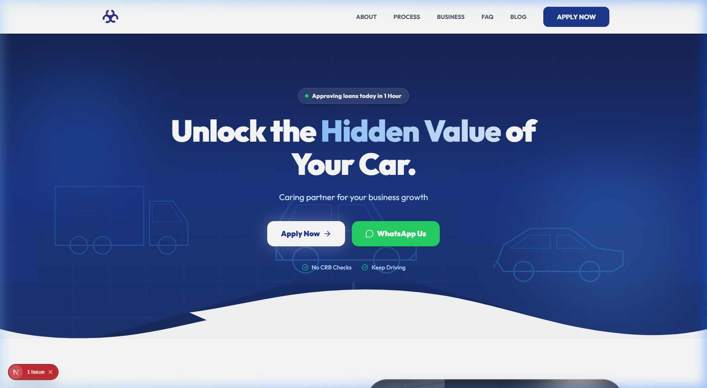

# 🚀 Coin Care Capital - Digital Headquarters

Welcome to the **Coin Care Capital Digital Headquarters**! 

> **🌐 Live Staging Site:** You can view the current, live progress of the website at any time by visiting: **[https://frontend-deploy-ten.vercel.app/](https://frontend-deploy-ten.vercel.app/)**

This documentation hub is designed specifically for you—the Coin Care team. Think of this as the master blueprint for your entire digital ecosystem. Whether you want to understand how a customer applies for a loan online, how to manage your marketing channels, or what features we are building next, you will find it all right here. 

**No technical jargon required.** We've translated the complex software architecture into clear, business-focused language.

---

## 🗺️ The Site Map

We've organized everything into clear, easy-to-read sections. Click on any of the folders below to explore:

### 🤝 1. START HERE: Client Deliverables & Progress
**🚨 This is your primary dashboard.** Check this section to review the project proposal, track the timeline, and view visual galleries of the ongoing design work.
*   📄 **[Project Proposal](./client-deliverables/01-project-proposal.md)** - What we are building and our scaling strategy.
*   🗺️ **[Sitemap & Features](./client-deliverables/02-sitemap-features.md)** - The structural layout of your website.
*   ⏱️ **[Project Timeline](./client-deliverables/03-project-timeline.md)** - Our delivery schedule.
*   🖼️ **[UI Visual Gallery](./client-deliverables/07-ui-gallery.md)** - Desktop screenshots of your beautiful new website.
*   📱 **[UI Mobile Gallery](./client-deliverables/08-ui-mobile-gallery.md)** - Screenshots showing the flawless mobile experience.
*   ✍️ **[CMS User Guide](./client-deliverables/06-cms-user-guide.md)** - How your non-technical staff can update website content easily.

### 💼 2. Business Operations
How the technology supports your daily operations and speeds up loan disbursements.
*   🔄 **[Loan Workflow](./business/loan-workflow.md)** - The step-by-step journey of a digital loan application.
*   💰 **[Pricing & Fees](./business/pricing.md)** - Internal reference for interest rates, processing fees, and LTV limits.
*   🎯 **[Competitor Analysis](./business/competitor-analysis.md)** - How we outmaneuver Platinum Credit, Mwananchi, and others.
*   ⚖️ **[Legal & Compliance](./business/legal-compliance.md)** - Ensuring strict adherence to data protection and financial regulations.

### 📈 3. Marketing & Lead Generation
How we drive traffic and capture high-quality borrower leads.
*   🔍 **[SEO Strategy](./marketing/seo-strategy.md)** - Dominating Google searches for "logbook loans in Kenya".
*   📱 **[Social Media Guide](./marketing/social-media-strategy.md)** - Our strategy for TikTok, Instagram, Facebook, and X.
*   ✉️ **[Email & SMS Marketing](./marketing/email-marketing-strategy.md)** - Retaining past customers for repeat borrowing.
*   📢 **[Paid Ads Strategy](./marketing/paid-ads-strategy.md)** - High-conversion Google and Meta ad campaigns.

### 🤖 4. Internal Tools & Automation (The "Secret Sauce")
How we use AI and smart software to process loans faster than the competition.
*   ⚡ **[Workflow Automation](./internal-tools/workflow-automation.md)** - "Invisible" pipelines that automatically alert staff of new leads.
*   🧠 **[AI Operations](./internal-tools/ai-automation.md)** - Our plan for AI Document Scanners (OCR) and 24/7 AI Voice Sales Agents.
*   🖥️ **[Admin Portal](./internal-tools/admin-portal.md)** - The central dashboard your team will use to approve and track loans.

### 🚀 5. Scaling & The Future
Where we are going next to ensure Coin Care Capital remains the market leader.
*   🛣️ **[Product Roadmap](./scaling/product-roadmap.md)** - The priority list for upcoming features (like the customer Loan Tracker).
*   📲 **[Mobile App Vision](./scaling/mobile-app-roadmap.md)** - The blueprint for our future iOS & Android app for returning customers.

### ⚙️ 6. Technical Architecture (For the Engineers)
The "under the hood" details ensuring the platform is fast, secure, and scalable.
*   🏗️ **[System Architecture](./technical/architecture.md)** - How the website, databases, and CMS connect.
*   🗄️ **[Database Schema](./technical/database-schema.md)** - How sensitive customer data is securely structured and stored.
*   🔒 **[Security Guidelines](./technical/security-guidelines.md)** - How we protect your business and your customers from cyber threats.
*   🔌 **[API Contracts](./technical/api-contracts.md)** - How our systems talk to external services like M-Pesa.
