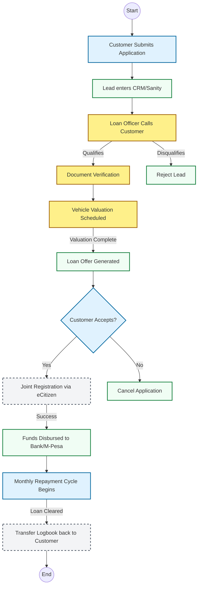

# Core Business Workflow: Logbook Loans

This document outlines the standard operating procedure and state machine for a Logbook Loan application at Coin Care Capital.

## Application Lifecycle Flowchart

The following Mermaid flowchart details the customer journey from the initial application on the web/mobile platform to final disbursement and repayment.

## Key SLAs (Service Level Agreements)
*   **Initial Call:** Within 15 minutes of web application submission.
*   **Valuation:** Within 1 hour (Nairobi Metro area).
*   **Disbursement:** Under 24 hours from initial application (provided NTSA systems are online).
