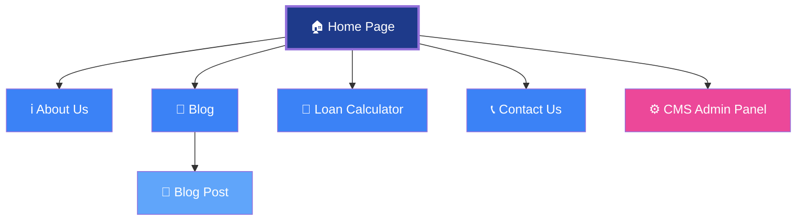
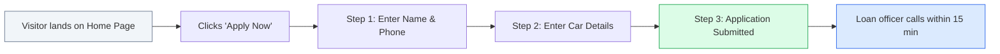
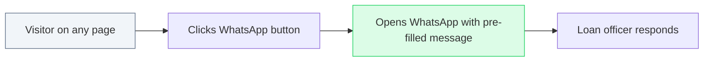
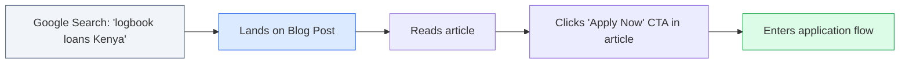

# Sitemap & Feature Breakdown

**Project:** Coin Care Capital  
**Date:** [Insert Date]  
**Version:** 1.0

---

## Visual Sitemap

---

## Page-by-Page Feature Breakdown

### 1. Home Page `/`

The home page is the primary marketing and conversion page. It is designed as a **single-page scroll experience** with multiple sections.

| Section | Purpose | Key Elements |
|---|---|---|
| **Navigation Bar** | Site-wide navigation | Logo, page links (About, Process, Business, FAQ, Blog), "Apply Now" button, mobile hamburger menu |
| **Hero Section** | First impression, primary CTA | Headline, tagline (editable via CMS), "Apply Now" button, "WhatsApp Us" button, trust badges ("No CRB Checks", "Keep Driving") |
| **About Us** | Build trust and credibility | Company story, key stats (24hr approval, 60% LTV), office image |
| **How It Works** | Reduce friction, explain process | 4-step visual flow: Apply Online → Free Valuation → Sign Documents → Get Funded |
| **Requirements** | Set expectations upfront | 6 required documents (logbook, ID, insurance, etc.), data security reassurance |
| **B2B / Business Growth** | Target business clients | Tabbed showcase (Logistics, Manufacturing, Retail), working capital examples, "Finance My Business" CTA |
| **FAQ Accordion** | Answer objections, reduce support calls | Expandable Q&A list (powered by CMS), WhatsApp CTA sidebar |
| **Footer** | Contact info, final CTA | Phone, email, postal address, "Apply Now" button |

**Interactive Features:**
- ✅ Multi-step "Apply Now" modal (3 steps: Personal Info → Vehicle Details → Confirmation)
- ✅ Animated scroll-triggered section reveals
- ✅ B2B industry tab switcher with animated content transitions
- ✅ FAQ accordion with expand/collapse animation
- ✅ WhatsApp click-to-chat buttons

---

### 2. About Page `/about`

| Feature | Description |
|---|---|
| Company history | Who we are, when we started, our mission |
| Team / Leadership | Key team members (optional) |
| Values | What differentiates Coin Care from competitors |
| Trust signals | CBK regulation, data security, customer count |

---

### 3. Blog `/blog`

| Feature | Description |
|---|---|
| Blog listing | Grid/list of all published articles |
| Category filtering | Filter by topic (e.g., "Tips", "News", "Guides") |
| Post cards | Image, title, excerpt, read time, publish date |
| Pagination | Handle growing content library |

### 3a. Blog Post `/blog/[slug]`

| Feature | Description |
|---|---|
| Full article | Title, author, date, category, featured image, full content |
| Related posts | Suggested reading at the bottom |
| Share buttons | WhatsApp, Twitter, Facebook (optional) |
| CTA banner | "Need a loan? Apply Now" banner within the article |

---

### 4. Loan Calculator `/calculator`

| Feature | Description |
|---|---|
| Loan amount slider/input | Range: KES 50,000 – KES 10,000,000 |
| Loan duration selector | 1 – 36 months |
| Interest rate | Pulled from CMS (Site Settings), currently 3.5% per month |
| Real-time calculation | Monthly payment, total interest, total repayable amount |
| Apply Now CTA | Pre-filled or linked to the application modal |

---

### 5. Contact Page `/contact`

| Feature | Description |
|---|---|
| Contact form | Name, email, phone, message |
| Direct contact info | Phone number, email, postal address |
| WhatsApp button | Click-to-chat |
| Office location | Google Maps embed or address card |
| Business hours | Operating hours display |

---

### 6. CMS Admin Panel `/admin`

This is the **Sanity Studio** — a visual content editor that the client's team uses to manage website content without any coding knowledge.

| Content Type | What the client can edit |
|---|---|
| **Site Settings** | Hero tagline, phone number, email, WhatsApp URL, loan interest rate |
| **Blog Posts** | Create, edit, delete articles with images, categories, and formatting |
| **FAQs** | Add, reorder, edit, or remove frequently asked questions |

---

## Global Features (All Pages)

| Feature | Description |
|---|---|
| **Responsive Design** | Optimized for mobile (360px), tablet (768px), and desktop (1280px+) |
| **SEO Optimization** | Unique title tags, meta descriptions, Open Graph tags per page |
| **Performance** | Server-side rendering, image optimization, code splitting |
| **HTTPS** | SSL certificate included (via Vercel) |
| **Analytics Ready** | Google Analytics / Tag Manager integration |
| **Accessibility** | Semantic HTML, keyboard navigation, color contrast compliance |

---

## User Flows

### Flow 1: Loan Application (Primary Conversion)

### Flow 2: WhatsApp Inquiry

### Flow 3: Content Discovery (Blog / FAQ)

