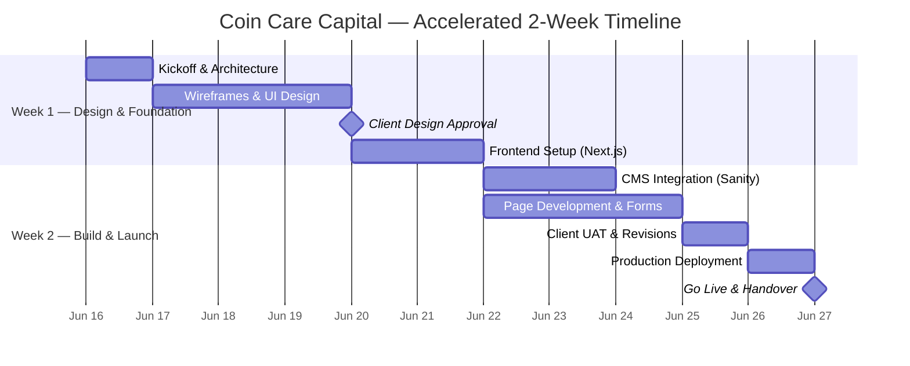

# Project Timeline & Milestones

**Project:** Coin Care Capital  
**Start Date:** [Insert Date]  
**Estimated Completion:** 2 Weeks from Start  
**Version:** 1.0

---

## Timeline Overview

---

## Detailed Milestones

### 🟦 Week 1: Design & Foundation

| Task | Duration | Deliverable | Client Action Required |
|---|---|---|---|
| Kickoff & Architecture | Day 1 | Project structure | Provide brand assets |
| UI/UX Design | Days 2-4 | High-fidelity UI mockups | **Approve designs** (Milestone 1) |
| Frontend Setup | Days 5-6 | Functional staging URL | None |

> **🔴 Gate:** Core development relies on rapid design approval by the end of Week 1.

---

### 🟩 Week 2: Build, Review & Launch

| Task | Duration | Deliverable | Client Action Required |
|---|---|---|---|
| CMS Setup & Integration | Days 7-8 | Working admin panel | Provide any remaining text |
| Full Development & Forms | Days 8-11 | Complete site on staging | Test forms & calculators |
| Client UAT & Revisions | Day 12 | Updated staging site | **Final Approval** |
| Deployment & SEO Setup | Day 13 | Premium cloud hosting setup | Provide domain access |
| Handover & Training | Day 14 | CMS Guide, Live Website | Attend brief handover call |

> **🟢 Launch Day!** By Day 14, the site is live and the final milestone is triggered.

---

## Communication Plan

| Item | Detail |
|---|---|
| **Rapid Check-ins** | Brief 10-minute updates every 2 days via WhatsApp/Meet. |
| **Staging URL** | Available continuously for real-time progress tracking. |
| **Feedback Channel** | Consolidated feedback via email or shared document. |

---

## Assumptions & Risks

| Risk | Impact | Mitigation |
|---|---|---|
| Delayed content from client | Timeline slips | Placeholder text used; content swapped via CMS post-launch. |
| Design approval delays | Blocks development | Max 24 hours for feedback requested. |
| Third-party downtime | Temporary outage | Premium hosting has 99.9% uptime SLAs. |
