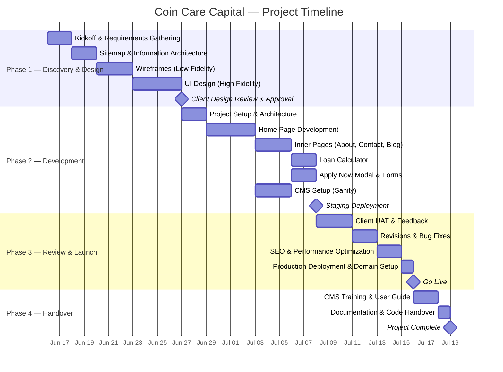

# Project Timeline & Milestones

**Project:** Coin Care Capital  
**Start Date:** [Insert Date]  
**Estimated Completion:** 5 Weeks from Start  
**Version:** 1.0

---

## Timeline Overview

---

## Detailed Milestones

### 🟦 Phase 1: Discovery & Design (Week 1–2)

| Task | Duration | Deliverable | Client Action Required |
|---|---|---|---|
| Kickoff meeting | Day 1 | Meeting notes, confirmed requirements | Attend meeting, provide brand assets |
| Sitemap & feature breakdown | 2 days | Sitemap document | Review and approve |
| Wireframes (low-fidelity) | 3 days | Wireframe screens (Figma or images) | Review and give feedback |
| High-fidelity UI designs | 4 days | Polished design mockups | **Approve designs** (Milestone 1 payment) |

> **🔴 Gate:** Development does NOT begin until designs are approved by the client.

---

### 🟩 Phase 2: Development (Week 2–4)

| Task | Duration | Deliverable | Client Action Required |
|---|---|---|---|
| Project setup (Next.js, Tailwind, Sanity) | 2 days | GitHub repo, project structure | None |
| Home page (all sections) | 4 days | Functional home page on staging | Provide any remaining content |
| Inner pages (About, Blog, Calculator, Contact) | 5 days | All pages functional | Provide About Us text, FAQs |
| CMS setup & content modeling | 3 days | Working admin panel at `/admin` | None |
| Apply Now modal | 2 days | Working application form | Confirm form fields |
| Staging deployment | 1 day | **Live staging URL for review** | None |

> **🔴 Gate:** Client reviews staging site and provides consolidated feedback.

---

### 🟨 Phase 3: Review & Launch (Week 4–5)

| Task | Duration | Deliverable | Client Action Required |
|---|---|---|---|
| Client UAT (User Acceptance Testing) | 3 days | Feedback document | Test all features, report issues |
| Revisions & bug fixes | 2 days | Updated staging site | Confirm fixes |
| SEO & performance optimization | 2 days | Lighthouse report (target: 90+) | None |
| Domain setup & production deploy | 1 day | **Live website on client domain** | Provide domain DNS access |

> **🟢 Launch Day!**

---

### 🟪 Phase 4: Handover & Support (Week 5+)

| Task | Duration | Deliverable | Client Action Required |
|---|---|---|---|
| CMS training session | 1 session (1 hr) | Screen recording / live walkthrough | Attend training |
| CMS user guide | 1 day | PDF/Markdown guide | None |
| Code & documentation handover | 1 day | GitHub access, technical docs | None |
| Post-launch support | 30 days | Bug fixes, minor adjustments | Report any issues |

---

## Communication Plan

| Item | Detail |
|---|---|
| **Weekly check-in** | Every [Day] at [Time] via Google Meet / Zoom / WhatsApp call |
| **Progress updates** | Shared via WhatsApp / Email every [frequency] |
| **Staging URL** | Shared once development begins — client can check progress anytime |
| **Feedback channel** | Consolidated feedback via email or shared document (not scattered WhatsApp texts) |
| **Emergency contact** | [Your phone number] for urgent issues |

---

## Assumptions & Risks

### Assumptions
1. Client provides all written content (About Us, FAQs, blog posts) within 5 business days of request.
2. Client provides brand assets (logo, colors) before design begins.
3. Domain is already registered by the client.
4. Client designates a single decision-maker for approvals.

### Risks & Mitigation

| Risk | Impact | Mitigation |
|---|---|---|
| Delayed content from client | Timeline slips by equivalent days | Placeholder text used; content can be swapped via CMS later |
| Scope creep (new feature requests mid-project) | Budget and timeline increase | All new requests documented as change orders with separate quotes |
| Design approval delays | Blocks development start | Max 3 business days for feedback at each gate |
| Third-party service downtime (Vercel, Sanity) | Temporary site outage | Both services have 99.9% uptime SLAs; alternatives can be configured |
