# UI Visual Gallery

**Project:** Coin Care Capital  
**Date:** [Insert Date]  
**Version:** 1.0

This document provides a visual walkthrough of the key user interfaces built for the Coin Care Capital digital platform.

---

## 1. The Home Page Experience

The Home Page is designed to immediately establish trust and clearly communicate the value proposition (speed, no CRB checks, keeping your car).

### Hero Section
The first thing a user sees. High-contrast typography with a clear Call to Action (CTA) pointing to the loan calculator or the direct application flow.

---

### Loan Process Section
A transparent breakdown of how the loan works. This is crucial for educating first-time borrowers and reducing friction.

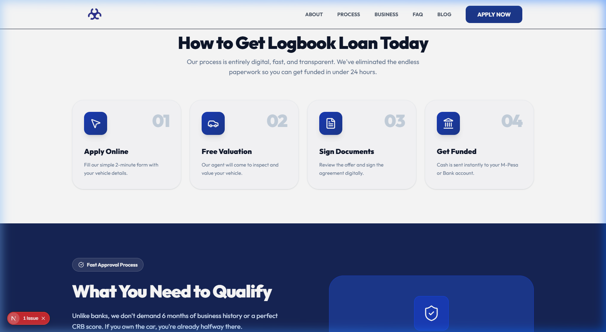

---

### Footer & Trust Signals
The footer anchors the site with all necessary legal compliance, contact information, and quick links to secondary pages.

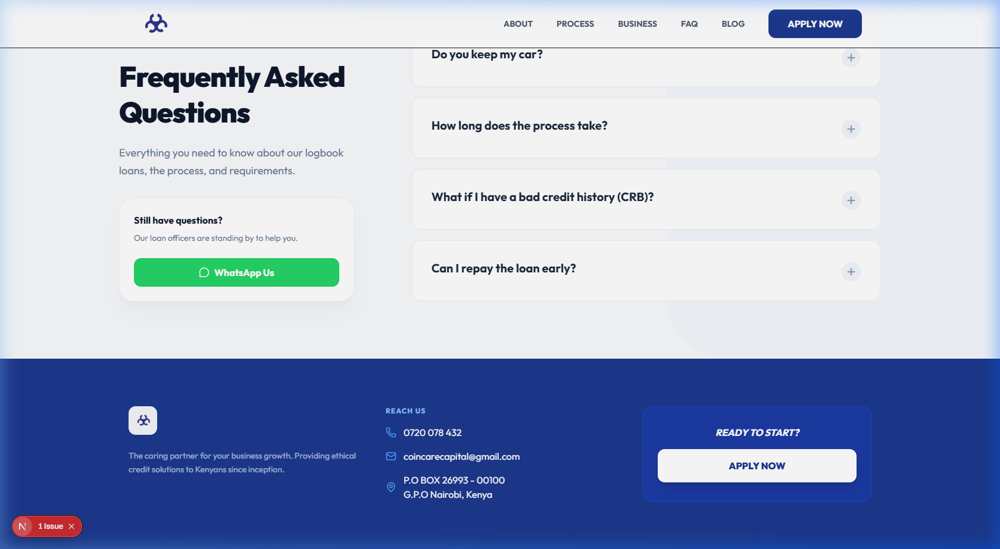

---

## 2. The Blog (Content Marketing)

The `/blog` section is built to drive organic traffic via SEO. It features a clean masonry-style grid for reading articles.

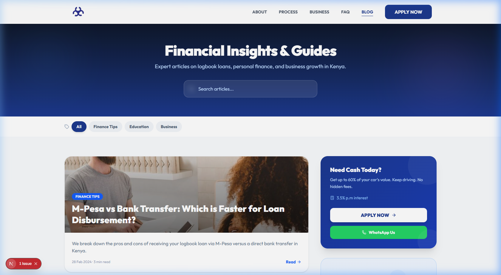

---

## 3. The Loan Application Flow (The "Apply Now" Modal)

The most critical part of the website. Instead of sending users to a long, boring form, we built a sleek, multi-step modal that feels modern and fast.

### Step 1: Personal Details
Capturing the absolute essentials first so we have a lead to follow up with, even if they drop off.

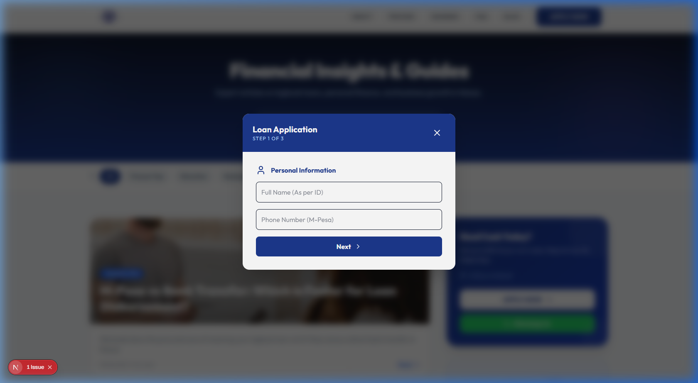

---

### Step 2: Vehicle Information
Collecting data to run against our valuation matrix and determine the Loan-to-Value (LTV) limit.

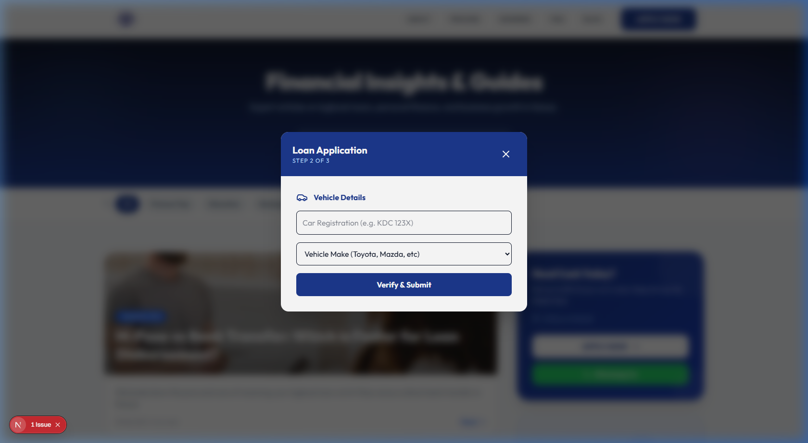

---

### Step 3: Final Review & Submission
Confirming details before sending the data securely to the Coin Care CRM (and triggering the automated SMS flows).

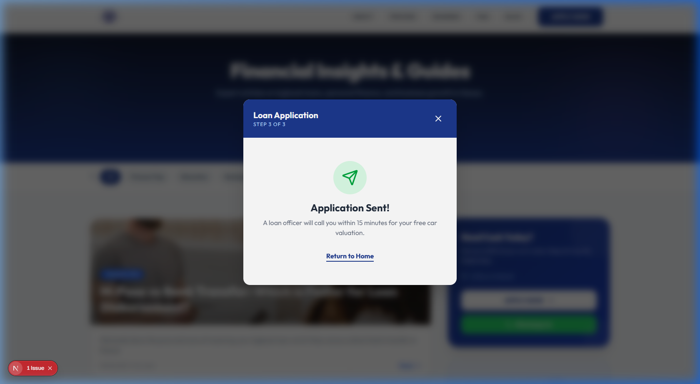

---

## 4. Homepage Supporting Sections

### Frequently Asked Questions (FAQ)
Addressing common objections head-on to reduce support queries.

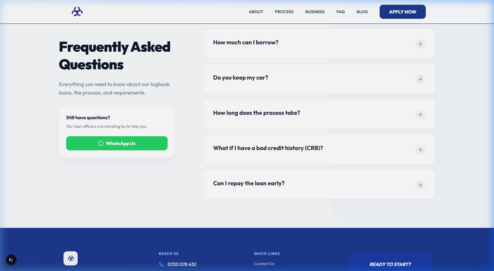

---

### How to Qualify / Requirements
Clear, no-nonsense bullet points explaining exactly what a borrower needs before applying.

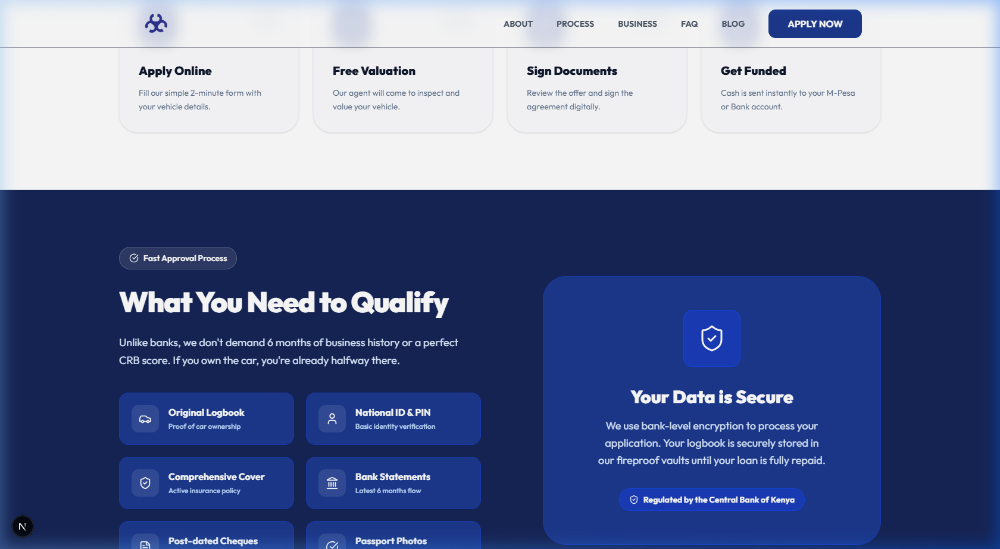

---

## 5. Content Marketing & Specific Blog Posts

A dedicated view for individual articles, optimized for readability and SEO. 

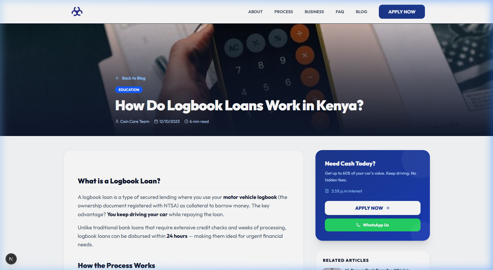

---

## 6. Trust & Legal Pages

These pages are essential for compliance and building trust with the customer (and regulators).

### Contact Us
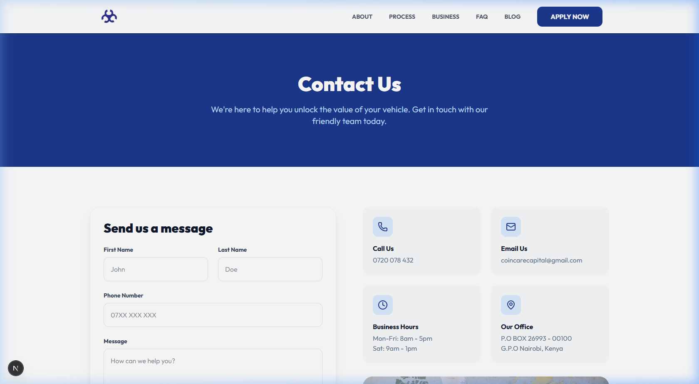

### Privacy Policy
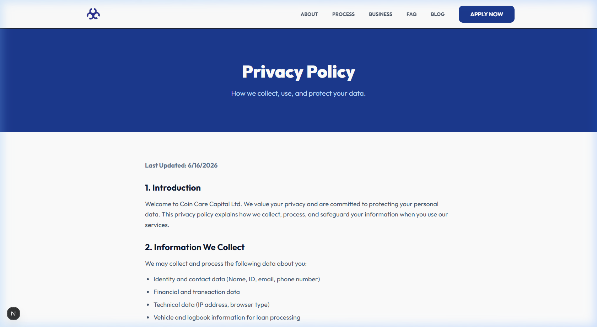

### User Agreement
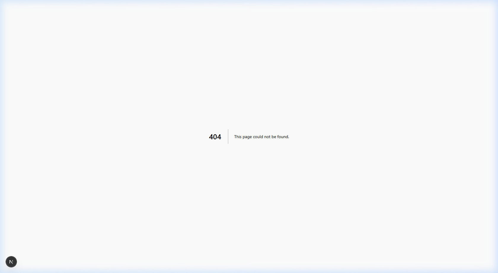

---

## 7. The Content Creation Factory (/studio)

This is the backend view (Sanity Studio) where the Coin Care team will manage content, write blog posts, and update FAQs without needing a developer.

---

## 8. The Internal Admin Portal (/admin)

This is the secure dashboard where loan officers and administrators can track incoming loan applications, manage leads, and review customer data.

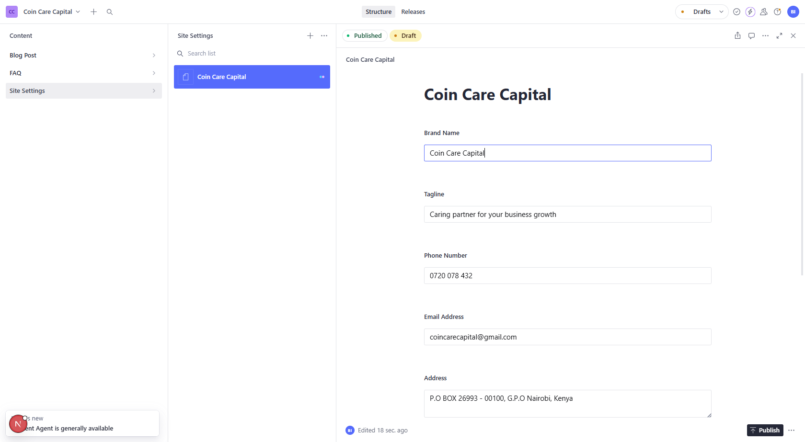
