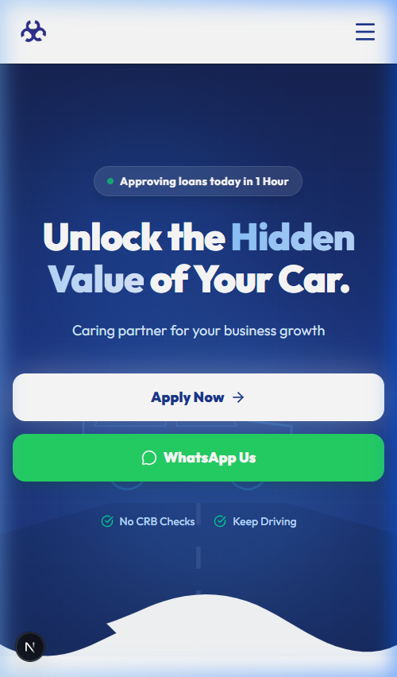
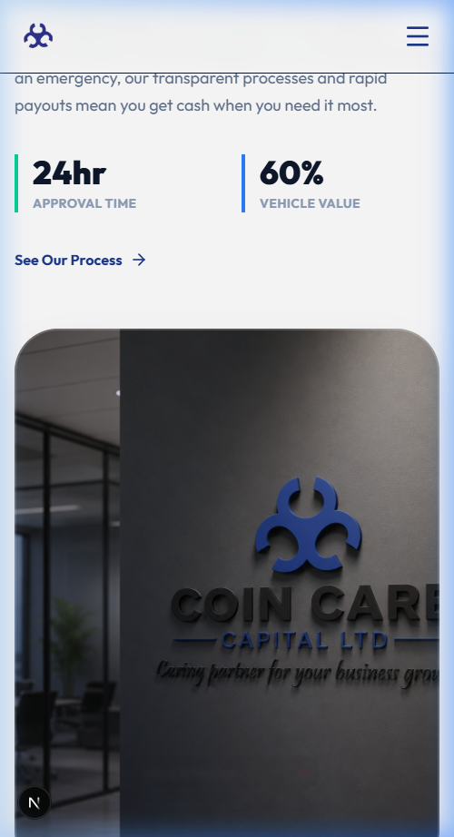
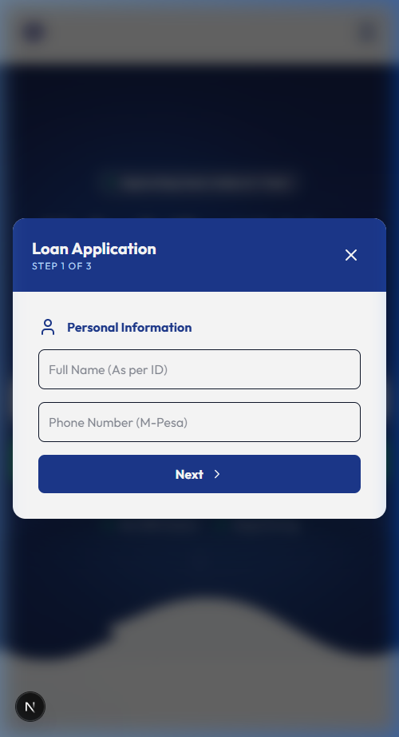

# Mobile UI Visual Gallery

**Project:** Coin Care Capital  
**Date:** [Insert Date]  
**Version:** 1.0

This document provides a visual walkthrough of the mobile-responsive user interface. Since a large portion of our target demographic will access the platform via mobile devices (e.g., Opera Mini, Chrome for Android), a flawless mobile experience is critical.

---

## 1. The Mobile Home Page

The mobile experience prioritizes the "Apply Now" Call-to-Action and ensures that the core value propositions are readable on small screens without excessive scrolling.

### Mobile Hero Section
Notice how the CTA is prominent and the layout shifts to a vertical stack, making it easy to tap with a thumb.

---

### Content & Process Sections
The educational content (like the Loan Process or Calculator) adapts to horizontal swipes or vertical stacking, ensuring text remains legible and engaging.

---

## 2. The Mobile Application Flow

The "Apply Now" modal is fully responsive. It takes over the screen on mobile to act like a native app experience, preventing distractions while the user is filling out their details.

### Step 1: Personal Details (Mobile View)
The inputs are sized specifically for touch targets, and the layout feels like a modern app interface.

