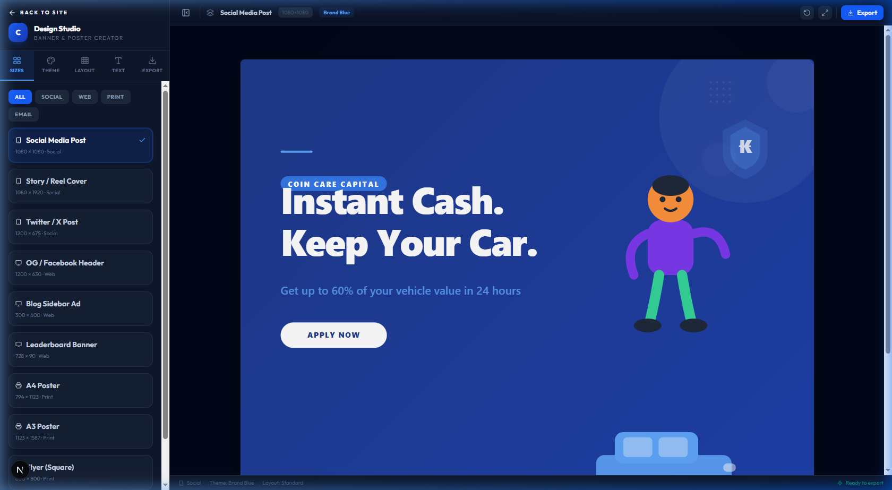

# 🎨 Content Creation Factory

The **Content Creation Factory** is Coin Care Capital's in-house content generation engine. It is accessible directly within the website at `/studio` and allows any team member — even without design or technical skills — to produce professional, on-brand marketing materials in minutes.

***

## Why This Matters

Most small financial institutions in Kenya struggle with **consistent branding** across their social media channels. They either:

* Pay a graphic designer KES 500–2,000 per post (which adds up fast), or
* Create inconsistent, low-quality graphics in Canva that damage brand perception.

The Content Creation Factory solves this by giving your team a **pre-loaded toolkit** with your exact brand colors, fonts, logo, and templates — so every single piece of content looks like it was made by a professional agency.

***

## What It Can Generate

### 📱 Social Media Posts

Ready-to-download graphics optimized for each platform's dimensions:

* **Facebook & Instagram** (1080x1080 square posts, 1080x1920 stories)
* **X / Twitter** (1200x675 banners)
* **TikTok** (1080x1920 cover images)

**Use Cases:**

* 🎄 Holiday greetings (Christmas, Eid, Mashujaa Day, Jamhuri Day)
* 📢 Company news & announcements
* 💰 Loan promotion campaigns ("Get up to 70% LTV this December!")
* 🏆 Customer success stories & testimonials
* 📊 Financial tips & educational content

### 📄 Branded Flyers & Documents

Professional-quality printable materials:

* Loan product flyers (PDF, ready for printing)
* Company brochures
* Internal memos and circulars
* Event invitations

### ✍️ Blog Posts & Articles

SEO-optimized content published directly to the website:

* Educational articles ("How Do Logbook Loans Work in Kenya?")
* Market updates and company news
* FAQ expansions

***

## How It Works (3 Simple Steps)

### Step 1: Choose a Template

Select from pre-built templates designed specifically for Coin Care Capital. Every template already has the correct logo, brand colors (Gold, Deep Blue, White), and typography locked in.

### Step 2: Customize the Content

Simply type in your message. Change the headline, update the offer details, or swap the background image. The brand styling stays consistent no matter what you change.

### Step 3: Download & Share

Hit "Download" to get a high-resolution image or PDF. Share it directly to your social media pages, WhatsApp groups, or send it to the print shop.

***

## The Studio Interface

This is where your team creates and manages all marketing content. The interface is designed to be as simple as possible — no design experience needed.

***

## Content Calendar Suggestions

To keep your social media presence active and engaging, we recommend the following posting schedule:

| Day           | Content Type                 | Example                                          |
| ------------- | ---------------------------- | ------------------------------------------------ |
| **Monday**    | Financial Tip                | "3 Things to Check Before Taking a Logbook Loan" |
| **Wednesday** | Promotion / CTA              | "Apply Today — Get Cash Within 24 Hours!"        |
| **Friday**    | Customer Story / Testimonial | "James from Nakuru got KES 350K in 6 hours"      |
| **Saturday**  | Holiday / Community Post     | Seasonal greeting or community engagement        |

***

## Upcoming Enhancements (Proposed)

* **AI-Assisted Copy Generation:** Type a topic and the system will suggest compelling captions and hashtags.
* **Auto-Scheduling:** Connect your Facebook and Instagram accounts to automatically publish posts at optimal times.
* **Ad Creative Generator:** Create Facebook/Google ad variations for A/B testing directly from the factory.
