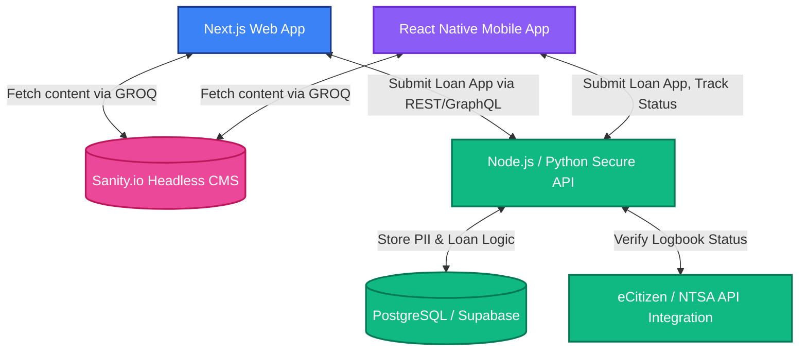

# System Architecture

This document details the planned infrastructure for the Coin Care Capital digital platform, transitioning from the current static prototype to a dynamic, scalable system.

## High-Level Architecture (Proposed)

We are adopting a MACH (Microservices, API-first, Cloud-native SaaS, Headless) architecture.

## Data Separation Strategy

1.  **Public Content (Sanity CMS):** 
    *   Blog Posts
    *   FAQs
    *   Marketing copy (Hero text, About Us)
    *   Branch locations
2.  **Private/Transactional Data (Custom Backend/Supabase):**
    *   User Profiles (Name, M-Pesa Number)
    *   Vehicle Registration Data
    *   Loan Application Status (Pending, Approved, Disbursed)
    *   Repayment Ledgers

## Next Steps for CMS Integration
1. Initialize a Sanity Studio in `Coin-Care/studio`.
2. Define the Schema types (e.g., `document { name: 'faq', type: 'document', fields: [...] }`).
3. Replace the mock data in `frontend/src/data` with Sanity `fetch` calls using GROQ.
