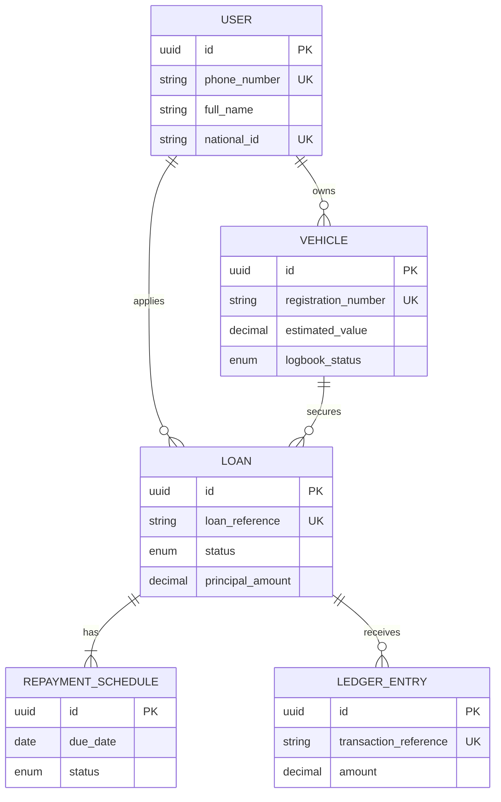

# Database Schema

To support the Loan Tracker (Phase 1) and the future custom CRM (Phase 2), we will adopt a relational database structure (PostgreSQL) managed via Prisma or Supabase.

Below is the proposed entity-relationship design for the core business logic.

## Core Entities

### 1. `User` (Borrowers)
Stores the personally identifiable information (PII) of the borrower.
*   `id` (UUID, Primary Key)
*   `phone_number` (String, Unique) - *Used for login/OTP*
*   `full_name` (String)
*   `national_id` (String, Unique)
*   `kra_pin` (String, Unique)
*   `email` (String, Optional)
*   `created_at` (Timestamp)

### 2. `Vehicle` (Collateral)
Stores the details of the car acting as collateral.
*   `id` (UUID, Primary Key)
*   `user_id` (UUID, Foreign Key -> `User.id`)
*   `registration_number` (String, Unique) - *e.g., KDC 123X*
*   `make_model` (String) - *e.g., Toyota Vitz*
*   `year_of_manufacture` (Integer)
*   `estimated_value` (Decimal) - *Set after physical valuation*
*   `logbook_status` (Enum: `CUSTOMER_HELD`, `JOINT_REGISTERED`, `COINCARE_HELD`)

### 3. `Loan` (The Tracker Core)
The central entity tying the borrower, collateral, and money together.
*   `id` (UUID, Primary Key)
*   `user_id` (UUID, Foreign Key -> `User.id`)
*   `vehicle_id` (UUID, Foreign Key -> `Vehicle.id`)
*   `loan_reference` (String, Unique) - *e.g., L-2026-8921*
*   `status` (Enum: `PENDING_VALUATION`, `APPROVED`, `DISBURSED`, `ACTIVE`, `CLEARED`, `DEFAULTED`)
*   `principal_amount` (Decimal)
*   `interest_rate_monthly` (Decimal)
*   `tenure_months` (Integer)
*   `total_repayable` (Decimal)
*   `disbursed_at` (Timestamp, Nullable)

### 4. `RepaymentSchedule` (Installments)
Breaks down the `Loan` into monthly chunks.
*   `id` (UUID, Primary Key)
*   `loan_id` (UUID, Foreign Key -> `Loan.id`)
*   `installment_number` (Integer) - *e.g., 1 of 12*
*   `due_date` (Date)
*   `amount_due` (Decimal)
*   `status` (Enum: `PENDING`, `PARTIAL`, `PAID`, `OVERDUE`)
*   `amount_paid` (Decimal)

### 5. `LedgerEntry` (Actual Payments)
Records actual money hitting the bank or M-Pesa paybill.
*   `id` (UUID, Primary Key)
*   `loan_id` (UUID, Foreign Key -> `Loan.id`)
*   `transaction_reference` (String, Unique) - *e.g., M-Pesa Receipt Number*
*   `amount` (Decimal)
*   `payment_method` (Enum: `MPESA`, `BANK_TRANSFER`, `CASH`)
*   `paid_at` (Timestamp)

## Diagram (Mermaid ER)

